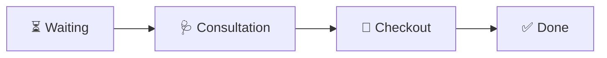

# Clinical Operations & Workflow Guide

This guide outlines the daily workflow procedures, clinical state transitions, and operational layouts of the **Sudha Dental Clinic Management System**.

---

## 🔐 1. Start of Day: Daily Session PIN

At the beginning of each day, the application locks out all dashboards and displays a **PIN Authentication** screen.
1. Enter the daily passcode: **`1234`** (stored securely in backend config).
2. Upon verification, a daily session token is saved in the browser's `localStorage`.
3. The authorization remains active for the current calendar date and expires automatically at midnight.

---

## 🔄 2. Dual Workspaces: Layout Modes

The clinic workspace can adapt to the layout of the clinical staff present on-site using the toggle in the top-right header:

### A. Solo Mode
- **Designed For**: Single-operator days (Dr. Mariyappan working solo).
- **Layout**: 
  - Left panel: Compact sidebar containing the Patient Search Input, **"+ Register New Patient"** button, and **Today's Queue List**.
  - Right workspace: The primary clinical dashboard. When a patient is selected from the queue, this workspace shows their active consultation form, prescribing panel, historical visits timeline, and RVG gallery.

### B. Nurse Mode
- **Designed For**: Dual-operator days (A Front-desk Nurse and Dr. Mariyappan consulting).
- **Layout (Split View)**:
  - **Left column (32% width) - Nurse Station Panel**: Locked to front-desk actions (Patient lookup, Queue registration, and Billing checkouts).
  - **Right column (68% width) - Doctor Workspace**: Locked to clinical activities (Patient consult card, Diagnosis inputs, medicine prescription list, X-ray uploads, and historical medical charts).

---

## 🧑‍🤝‍🧑 3. Patient Lifecycle & Queue Status Transitions

Patients flow through the clinic queue in four distinct states:

### Step 1: Admission & Check-in
1. **Search**: Search for existing patients by typing their name or phone number in the search bar.
   - If found, click the **"+ Queue"** button next to their name to add them to today's queue list.
2. **Registration**: If the patient is new, click **"+ Register New Patient"**, fill in the demographics (Name, Phone, DOB, Gender, Address), and submit. The system will register them in the master directory and place them directly into the queue.
3. Upon check-in, the patient enters the `WAITING` column/status. The elapsed time they have been waiting is displayed on their card.

### Step 2: Consultation & Prescription
1. When Dr. Mariyappan is ready, click **"Start Consult"** on the patient's queue card. This transitions their status to `CONSULTATION`.
2. Select the patient to load their details. In the Consultation panel, write:
   - **Chief Symptoms**
   - **Clinical Diagnosis**
   - **Consultation Fee**
   - **Follow-up Date** (optional)
3. **Prescribe Medicines**:
   - Use the searchable medicine dropdown. As you type, the system displays matched medicines (Dental Consumables or Medicines) alongside their active warehouse stock.
   - Enter the dosage/quantity. If the requested quantity exceeds current warehouse inventory, the system will highlight the input field in red.
4. Click **"Save Draft"** to update notes or click **"Save & Move to Checkout"** to shift the patient's status to `CHECKOUT`.

### Step 3: Billing & Automated Checkout
1. In the `CHECKOUT` column, select the patient to review their bill.
2. The system computes the total collections:
   $$\text{Total Invoice} = \text{Consultation Fee} + \text{Medicines Total Selling Value}$$
3. Click **"Collect & Complete"** to finalize:
   - **Inventory Deduction**: Core medication quantities are atomically deducted from database stocks.
   - **Automated Ledger Logging**: Financial income entries are created in the clinic account ledger (separated by consultation revenue and pharmacy sale records).
   - The patient transitions to the `DONE` status and is cleared from the active queue.

---

## 📁 4. Patient Historical Records & X-Rays (RVG)

Click the **"Patients"** navigation link in the top bar to open the master registry:
- **Interactive Directory**: Search the complete historical registry.
- **Demographics Card**: Access demographic metrics (total visits, prescriptions issued, and uploaded radiographs).
- **Clinical Timeline**: Read detailed records of all past consultations, including symptoms, diagnoses, doctor clinical notes, fees charged, and the exact medications/dosages dispensed.
- **RVG X-Ray Manager**:
  - View all dental radiographs and X-ray images associated with the patient in a responsive grid.
  - Upload new radiographs (PNG, JPEG) with custom notes.
  - Click any radiograph to load it in a full-screen high-resolution lightbox for diagnostic checks.
  - Delete retired radiographs.

---

## 📈 5. Financial Ledger & Daily Closing Reports

### Financial Ledger
- Tracks cash flows (Incomes and Expenses).
- Add manual clinic expenditures (Supplies, Utility bills, Staff Salaries, Rent) via the **"Add Expense"** form.
- Highlights net cash balance values (Green for positive net balance, Red for negative).

### Daily Closing Report
- Aggregates clinical statistics for the selected date:
  - Total Patient count
  - Total Collection (Consultation revenue + Pharmacy revenue)
  - Pharmacy sales quantity
  - Total clinic expenses
  - Net Income cash balances
- Print-friendly layout (CSS media queries hide navigation top bars and sidebar panels to provide a clean paper invoice layout when clicking **"Print Report"**).

---

## 💬 6. Automated Appointment Reminders

- The system runs an automated scheduling job daily at **18:00 (6:00 PM)**.
- It scans the patient database for appointments scheduled for tomorrow (`nextVisitDate`).
- For each scheduled patient, it constructs and logs an appointment reminder formatted for Twilio WhatsApp API transmission.
- Manual triggers are available at `/api/scheduler/test-reminders` for administrators to force-trigger reminder dispatches.
